# UART RTL-to-GDS Project

**Project:** `uart-rtl2gds-scl180`
**Technology:** SCL 180nm (`tsl18fs120_scl` std-cell family, `tsl18cio150` I/O pad family)
**Flow:** RTL Design → Simulation → Synthesis (Genus) → Physical Design (Innovus) → Signoff

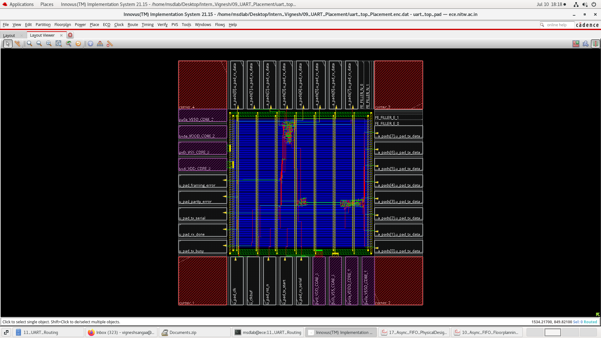

---

## 1. Project Overview

This project implements a complete **UART (Universal Asynchronous Receiver/Transmitter)** IP, taken through the full digital ASIC design flow — from RTL coding and verification, through logic synthesis, to physical design and signoff — targeting a 180nm standard-cell technology.

**Frame format:** 1 start bit (0) → 8 data bits (LSB first) → 1 even parity bit → 1 stop bit (1)
**Oversampling:** 16x baud tick, so RX samples mid-bit (tick 7/8) for noise-tolerant, reliable detection
**Default config:** `CLK_FREQ = 50 MHz`, `BAUD_RATE = 9600` (both are Verilog parameters, easily retargeted)

---

## 2. RTL-to-GDS Flow (Steps Performed)

```
1. RTL Coding (Verilog)
        │
        ▼
2. RTL Functional Simulation (Xcelium 24.09-s005)   ──►  sim/uart_tb.vcd
        │
        ▼
3. Logic Synthesis (Genus 21.14-s082_1)             ──►  syn/output_files/*
        │  (constraints.sdc, run.tcl)
        ▼
4. Gate-Level Sim + Logical Equivalence Check (Conformal 21.10-s300)
        │  RTL vs. Netlist zero-delay GLS + LEC     ──►  lec_gls_post_syn/{gls, lec}
        ▼
5. Floorplanning (Innovus 21.15-s110_1)              ──►  pd/innovus/floorplan
        │
        ▼
6. Power Planning                                     ──►  pd/innovus/powerplan
        │
        ▼
7. Placement                                          ──►  pd/innovus/placement
        │
        ▼
8. Clock Tree Synthesis (CTS)                         ──►  pd/innovus/cts
        │
        ▼
9. Routing                                            ──►  pd/innovus/routing
        │
        ▼
10. Signoff (STA + DRC + Geometric checks)            ──►  pd/innovus/signoff
```

Each stage's outputs are saved under the corresponding folder and cross-checked before moving to the next (e.g., LEC must pass before floorplanning; post-CTS timing must be clean before routing).

---

## 3. RTL Architecture & Code Explanation

### 3.1 `uart_top.v` — Top-Level Integration
Instantiates and wires together the three sub-blocks. Exposes two interfaces:
- **Parallel/system side:** `tx_start`, `tx_data`, `tx_busy`, `rx_data`, `rx_done`, `parity_error`, `framing_error`
- **Serial/pin side:** `tx_serial` (output, drives external RX pin), `rx_serial` (input, **asynchronous** — driven by an external TX pin)

A single `baud_gen` instance generates one shared `baud_tick_16x` pulse consumed by both `uart_tx` and `uart_rx`, guaranteeing both state machines run off the same time base.

### 3.2 `baud_gen.v` — Baud Rate Generator
Free-running counter that divides `clk` down to a **16x-oversampled baud tick**:

```
DIVISOR = CLK_FREQ / (BAUD_RATE * 16)
```

Produces a single-cycle `baud_tick_16x` pulse every `DIVISOR` clock cycles. 16x oversampling is the standard UART technique that lets the receiver sample the *middle* of each bit period instead of right at a bit edge, giving margin against clock/baud mismatch and line noise.

### 3.3 `uart_tx.v` — Transmitter
A 5-state Moore FSM (`IDLE → START → DATA → PARITY → STOP`) that:
1. Waits in `IDLE` with `tx_serial` held high (idle line state)
2. On `tx_start`, latches `tx_data` into `data_reg`, computes even parity as `^tx_data` (XOR-reduction of all 8 bits), and asserts `tx_busy`
3. Shifts out: start bit (0) → 8 data bits LSB-first → parity bit → stop bit (1)
4. Each state holds for exactly 16 `baud_tick_16x` pulses (one full bit period), tracked by `tick_cnt`
5. Returns to `IDLE` and deasserts `tx_busy` after the stop bit completes

### 3.4 `uart_rx.v` — Receiver
This is the more complex block because `rx_serial` is **asynchronous** to `clk` — the one genuine clock-domain-crossing (CDC) hazard in a UART design.

**CDC handling:** a 2-flop synchronizer (`rx_sync_ff1` → `rx_sync_ff2`) resolves potential metastability before any FSM logic touches the signal. Only `rx_sync_ff2` (the synchronized, glitch-free version) is used downstream.

**RX FSM** (`IDLE → START → DATA → PARITY → STOP`):
- `IDLE`: watches for a falling edge on the synchronized line (possible start bit)
- `START`: samples at tick 7 to *confirm* it's a real start bit and not a glitch — if the line has gone back high, it aborts back to `IDLE` (false-start rejection)
- `DATA`: samples each of the 8 data bits at tick 7 (mid-bit), shifting into `data_reg`
- `PARITY`: samples the received parity bit at tick 7 into `parity_calc`
- `STOP`: samples the stop bit at tick 7 — asserts `framing_error` if it isn't a 1, asserts `parity_error` if `^data_reg != parity_calc`, and pulses `rx_done` for one cycle with the received byte on `rx_data`

All three error/output signals (`rx_done`, `parity_error`, `framing_error`) are **1-cycle pulses**, defaulted low each cycle and only asserted in the exact cycle they're valid.

### 3.5 `uart_tb.v` — Self-Checking Testbench
A loopback testbench: `tx_serial` is wired directly to `rx_serial`, so every byte sent through TX must arrive correctly on RX.

Key verification details:
- **Sticky-latch technique for `rx_done`:** since `rx_done` can pulse *before* `tx_busy` deasserts (RX finishes its stop bit slightly ahead of TX), a naive `wait(rx_done)` issued after waiting on `tx_busy` could race past the pulse and hang. The TB latches every `rx_done` pulse (plus `rx_data`, `parity_error`, `framing_error`) into sticky registers via an edge-triggered always block, so the checking task can safely poll the latch afterward.
- **Test list:** directed edge cases (`0x00`, `0xFF`, `0xA5`, `0x5A`, `0x01`, `0x80`), back-to-back frames with no gap (`0x3C`, `0xC3`), and 10 randomized bytes.
- **Scoreboard:** `pass_count` / `fail_count` with a final PASS/FAIL summary.
- **Safety timeout:** 30 ms simulated-time watchdog in case a test hangs.
- **Waveform dump:** `uart_tb.vcd` for SimVision viewing.

---

## 4. Technology Library Setup (Multi-Corner Multi-Mode)

Signoff was run across the standard **MCMM (Multi-Corner Multi-Mode)** corner pair:

| Corner | Std-Cell Library | I/O Pad Library | Purpose |
|---|---|---|---|
| **ss** (slow-slow) | `tsl18fs120_scl_ss` | `tsl18cio150_max` | Worst-case — **setup** timing signoff |
| **ff** (fast-fast) | `tsl18fs120_scl_ff` | `tsl18cio150_min` | Best-case — **hold** timing signoff |

- The **ss/max** corner (slowest cells, worst-case RC) stresses setup paths and is the corner behind all the setup numbers reported below.
- The **ff/min** corner (fastest cells, best-case RC) stresses hold paths — particularly important on the 2-flop CDC synchronizer in `uart_rx`, where hold races are the classic failure mode.
- Wireload mode: `enclosed`. Area mode: `timing library`.

---

## 5. Synthesis Results (Genus 21.14-s082_1)

### Area (`final_area.rpt`, `final_qor.rpt`)

| Metric | Value |
|---|---|
| Total Cell Area | 42,816.822 µm² |
| Net Area | 94.176 µm² |
| **Total Area** | **42,910.998 µm²** |
| Leaf Instance Count | 293 |
| Sequential Instances | 63 |
| Combinational Instances | 230 |
| Hierarchical Instances | 4 |
| Total Leakage Power | 26,187.806 nW (~26.2 µW) |

**Per-block breakdown:**

| Instance | Module | Cell Count | Total Area (µm²) |
|---|---|---|---|
| `u_baud_gen` | `baud_gen` | 28 | 1,110.810 |
| `u_uart_rx` | `uart_rx` | 140 | 4,720.476 |
| `u_uart_tx` | `uart_tx` | 89 | 3,235.887 |
| **`u_uart_top` (sum)** | `uart_top` | **257** | **9,068.255** |
| **Top (with pads)** | `uart_top_pad` | **293** | **42,910.998** |

The jump from 9,068 µm² (core logic only) to 42,911 µm² (with pads) is because the I/O pad ring (`tsl18cio150_max` cells: `pc3c01`, `pc3d01`, `pc3d01u`, `pc3o01`) dominates total area and leakage power (99.3% of total leakage) — expected for a small core like this UART surrounded by a full pad frame.

### Timing (`final_timing.rpt`)

- Worst setup path: **tx_data[2] → u_uart_tx_parity_bit_reg/D**
- **Setup slack: 9,127 ps (MET)**
- Input delay constraint: 8,000 ps
- Data path delay: 1,651 ps
- Setup uncertainty: 150 ps

### QoR Summary (`final_qor.rpt`)
- Timing violations: **0**, TNS = 0.0 — clean at synthesis
- Runtime: 27 s elapsed

### Synthesized Schematics (Genus)

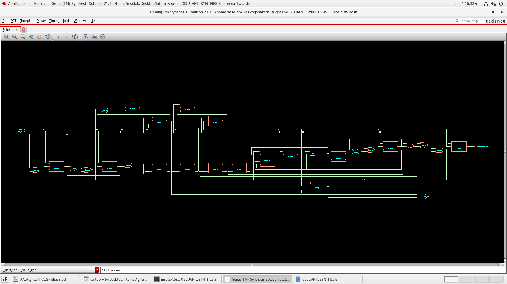
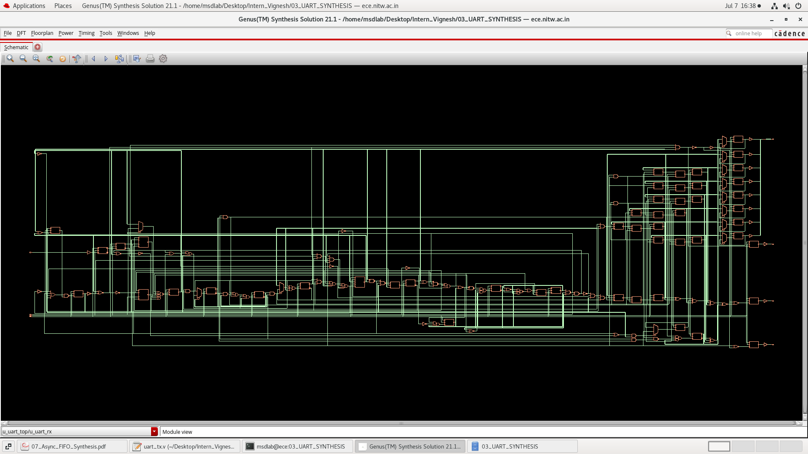
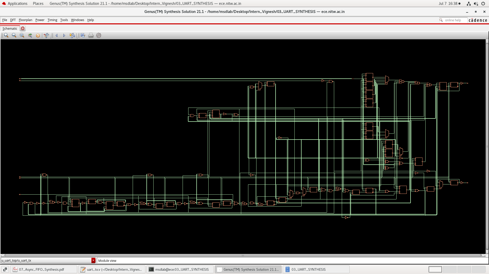
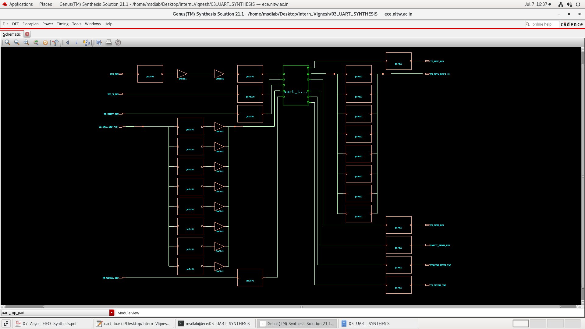
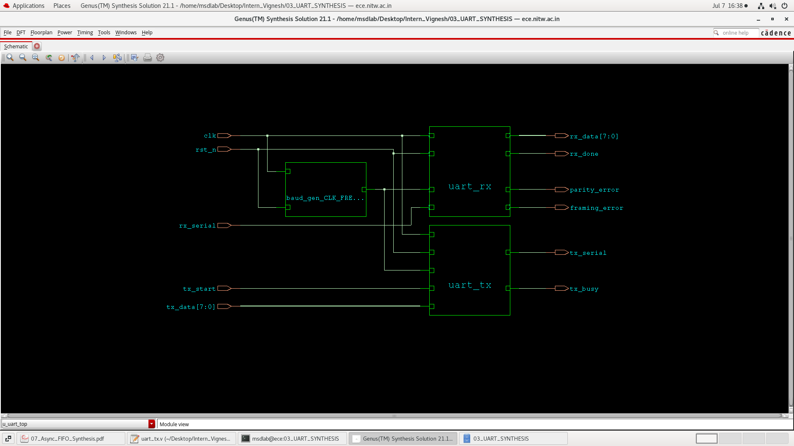

---

## 5A. Power Analysis (`uart_top_power.rpt`)

| Category | Leakage (W) | Internal (W) | Switching (W) | Total (W) | Row % |
|---|---|---|---|---|---|
| Memory | 0 | 0 | 0 | 0 | 0.00% |
| Register | 9.31475e-07 | 2.18836e-05 | 1.08379e-06 | 2.38989e-05 | 74.21% |
| Latch | 0 | 0 | 0 | 0 | 0.00% |
| Logic | 6.54949e-07 | 3.27510e-06 | 1.87491e-06 | 5.80496e-06 | 18.03% |
| Clock | 0 | 0 | 2.49900e-06 | 2.49900e-06 | 7.76% |
| Pad | 0 | 0 | 0 | 0 | 0.00% |
| **Subtotal** | **1.58642e-06** | **2.51587e-05** | **5.45770e-06** | **3.22028e-05** | **100.00%** |
| **% of Total** | **4.93%** | **78.13%** | **16.95%** | **100.00%** | — |

**Total power = 32.2028 µW**

- Dominated by **internal power (78.13%)** — expected, since switching activity inside register/logic cells is the largest contributor for a control-heavy design like a UART.
- **Registers alone account for 74.21%** of total power — consistent with the FSM-heavy TX/RX design (63 sequential elements).
- **Clock network power is 7.76%**, entirely switching power, with 0 leakage/internal — matches the CTS report showing 0 buffers/inverters inserted (a single small, unbuffered clock tree).
- **Leakage is a small fraction (4.93%)** of total power, as expected for this process node and design size.

---

## 6. Gate-Level Simulation & Equivalence Checking

- **GLS (Gate-Level Simulation):** zero-delay simulation run in `lec_gls_post_syn/gls` using **Cadence Xcelium 24.09-s005**, confirming the synthesized netlist behaves functionally the same as RTL under the same testbench.
- **LEC (Logical Equivalence Check):** `rtl2intermediate.lec` in `lec_gls_post_syn/lec`, run using **Cadence Conformal 21.10-s300** — formally proves the synthesized gate-level netlist is logically equivalent to the RTL, catching any synthesis-introduced functional bugs before physical design.

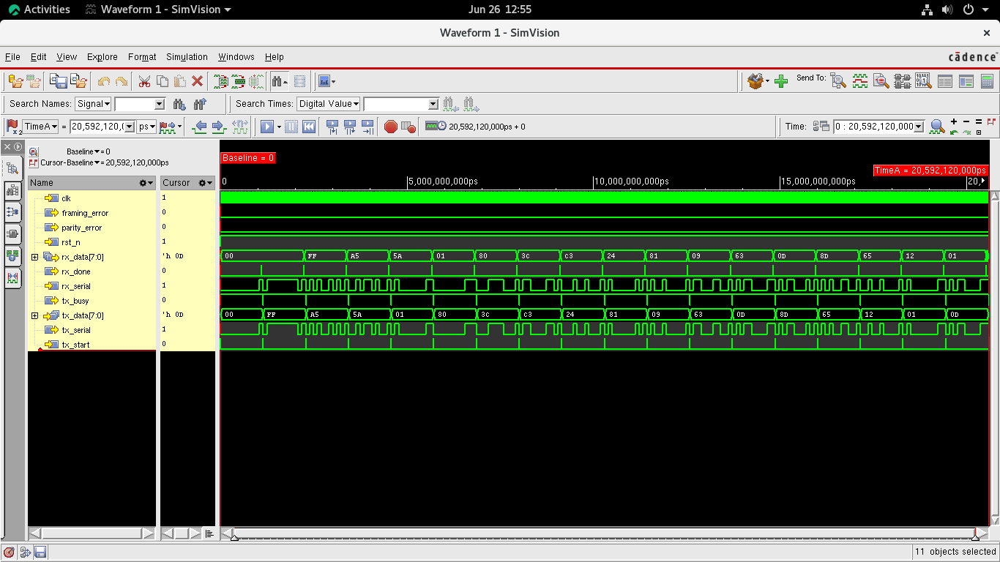

---

## 7. Physical Design Results (Innovus 21.15-s110_1)

### 7.1 Floorplan Specification

Floorplan was specified **by core size** (not die/IO/core coordinates), with a square aspect ratio:

| Parameter | Value |
|---|---|
| Specify by | Size |
| **Core Utilization** | **2.0637%** |
| Aspect Ratio (H/W) | 1.0 |
| **Core Dimensions ** | **665.32 * 665.32 µm²** |
| **Total Die Area** | **1265.0 × 1265.0 = 1,600,225 µm² (≈ 1.6 mm²)** |
| Core margins (to IO boundary) | Left 49.84 µm, Right 49.84 µm, Top 49.84 µm, Bottom 49.84 µm |
| Die size calculation | Min IO Height |
| Floorplan origin | Lower Left Corner |

The very low core utilization (~2%) reflects that die size here is being driven by the **minimum I/O pad ring perimeter** needed to fit all the pad cells around the small UART core, not by core cell density — this is normal and expected for a small digital block padded out for a standalone chip/tapeout shape.

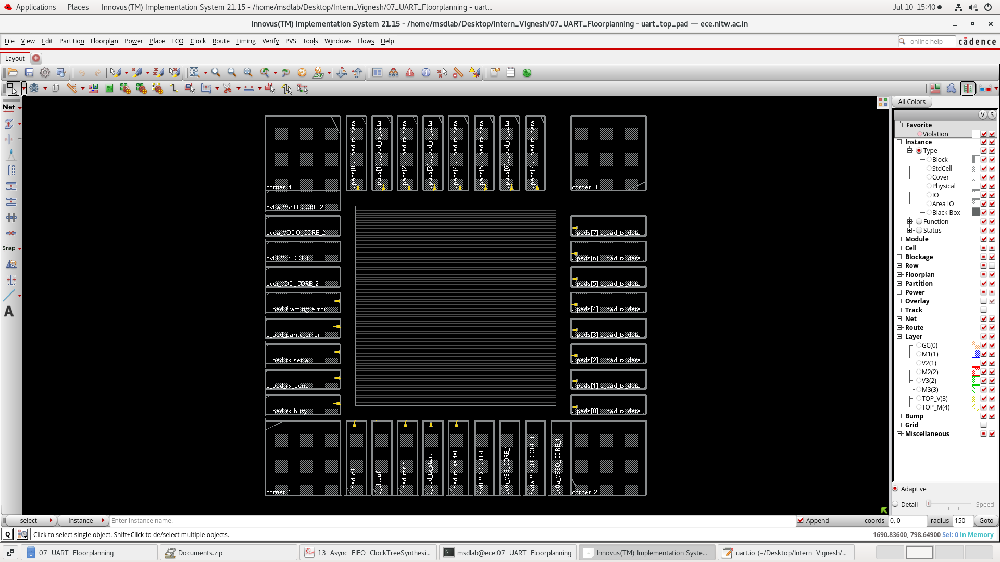


### 7.2 Floorplan → Power Plan → Placement → CTS → Routing → Signoff Summary

| Stage | Result |
|---|---|
| Floorplan | Core 665.32 × 665.32 µm², Die 1265.0 × 1265.0 µm², utilization 0.0206 |
| Power Plan | Power grid (`powerplanning`) built |
| Placement | Standard cells placed (`placement.png`) |
| CTS | Clock tree built and balanced, 0 violations |
| Routing | Fully routed, 0% overflow |
| Signoff | STA + DRC + geometric checks — all clean |

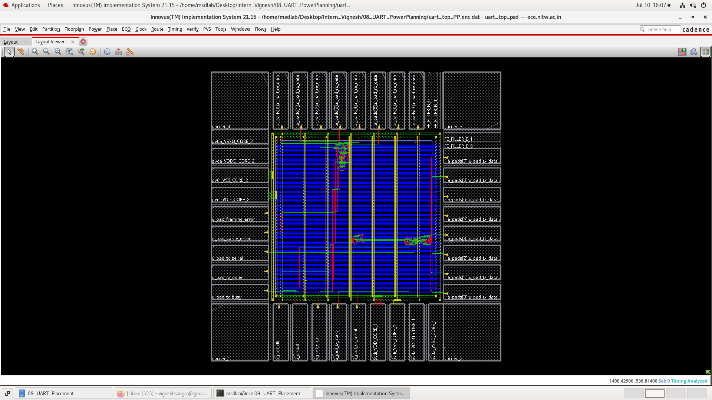

### 7.3 Clock Tree Synthesis (`uart_top_clock_trees.rpt`)

| Metric | Value |
|---|---|
| Clock sinks | 63 (all regular flops) |
| Buffers/Inverters inserted | 0 (single small clock tree — direct drive) |
| Total wire length | 444.742 µm |
| Max source-sink length | 114.283 µm |
| Max source-sink resistance | 62.359 Ω |
| Skew (setup.late) | 0.003 ns, 100% within target window |
| Clock net violations | None |
| Max cap/res/length/fanout/slew violations | 0 across the board |

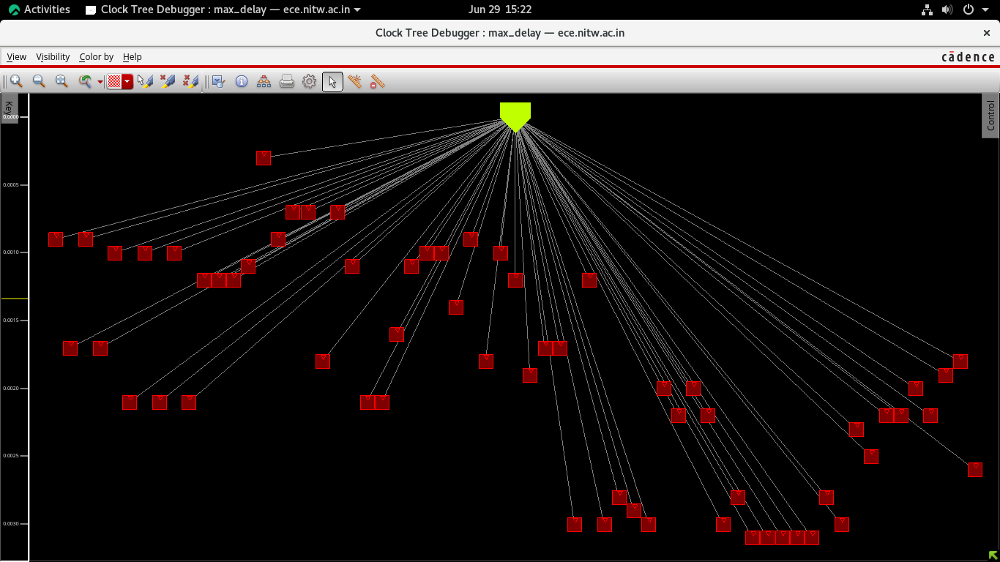

### 7.4 Post-CTS Timing (`uart_top_post_cts_timing.rpt`)

| Setup Mode | WNS (ns) | TNS (ns) | Violating Paths | All Paths |
|---|---|---|---|---|
| All | 8.281 | 0.000 | 0 | 121 |
| reg2reg | 13.391 | 0.000 | 0 | 99 |
| default | 8.281 | 0.000 | 0 | 35 |

**DRVs (Design Rule Violations) after CTS:**

| DRV Type | Nets (Terms) | Worst Violation |
|---|---|---|
| max_cap | 0 (0) | 0.000 |
| max_tran | 2 (4) | −0.102 |
| max_fanout | 1 (1) | −47 |
| max_length | 0 (0) | 0 |

- **Routing density (post-CTS): 0.99%** — this is the placed-cell density within the core area at the post-CTS checkpoint, not routing overflow. It is low because core utilization was set very low (0.0206) at floorplan time.
- **Routing overflow: 0.00% H / 0.00% V** (both minor DRVs above are non-critical and typical at this stage)

### 7.5 Congestion (`uart_top_congestion.rpt`)
- Usage: 4.9% H, 6.3% V
- **Overflow: 0.00% (H) + 0.00% (V)** — no congestion hotspots anywhere in the design

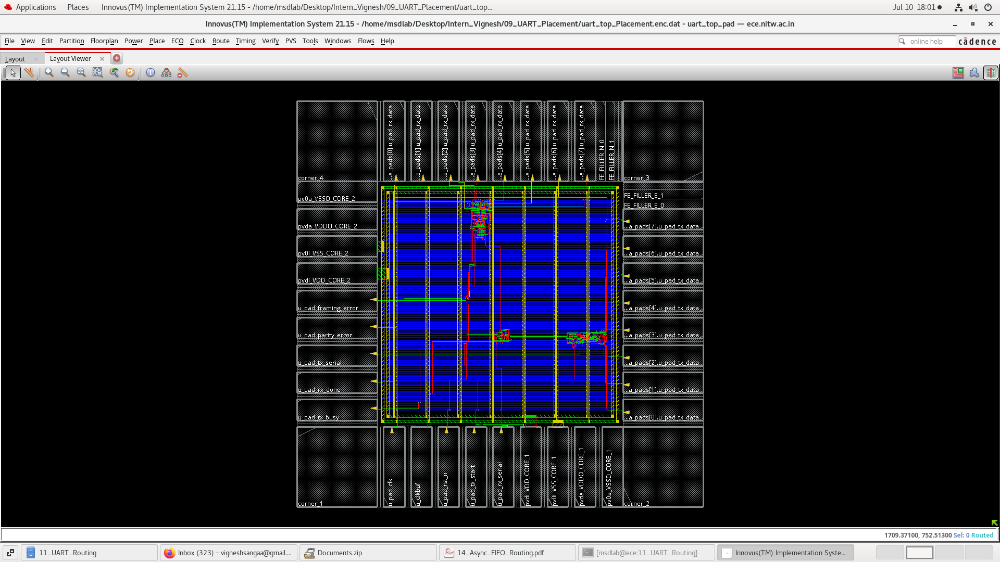

### 7.6 Signoff Timing (`uart_top_signOff.slk`, `uart_top_postRoute.slk`)

Post-route / signoff worst timing points:

| Path | Slack (ns) |
|---|---|
| `u_uart_tx_parity_bit_reg/D` (worst setup) | 8.275 (signoff) / 8.275 (post-route) |
| `u_uart_rx_rx_sync_ff2_reg/D` (CDC synchronizer, best margin) | ~18.17 |

All reported paths across `preCTS → signOff → postRoute` stayed **positive and MET** with no degradation of note between stages — timing was preserved cleanly through CTS and routing.

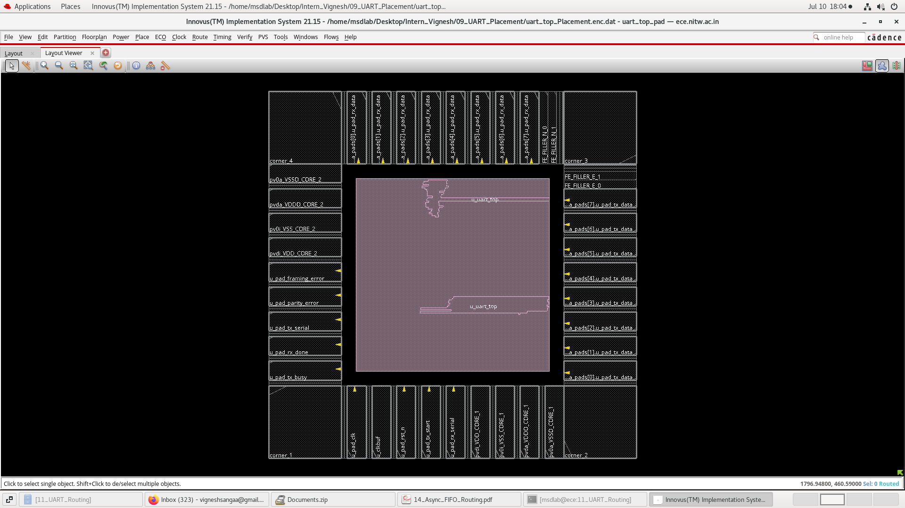

### 7.7 Skew Group Summary (`uart_top_skew_group.rpt`)
- Single skew group: `clk/all`, 63 constrained sinks, 0 unconstrained
- Skew (setup.late / hold.late): 0.003 ns, 100% occupancy within {0.000, 0.003} target window
- Min/max clock-path pins: min at `u_uart_rx_data_reg_reg[1]/CK`, max at `u_uart_tx_data_reg_reg[6]/CK`

---

## 8. Final Signoff Checklist

| Check | Result |
|---|---|
| timing (all corners) | ✅ Met (WNS 8.275 ns @ signoff) |
| DRC violations | ✅ 0 |
| Geometric violations | ✅ 0 |
| Routing overflow | ✅ 0.00% H / 0.00% V |
| Clock tree violations (cap/res/length/fanout/slew) | ✅ 0 |
| RTL vs. Netlist equivalence (LEC) | ✅ Passed |
| Gate-level simulation (GLS) | ✅ Passed (zero-delay) |
| RTL functional simulation (testbench) | ✅ All directed + randomized tests passed |

---

## 9. Tools Used

| Stage | Tool | Version |
|---|---|---|
| RTL Simulation / GLS | Cadence Xcelium | 24.09-s005 |
| Synthesis | Cadence Genus | 21.14-s082_1 |
| Physical Design (Floorplan → Signoff) | Cadence Innovus | 21.15-s110_1 |
| LEC | Cadence Conformal (LEC) | 21.10-s300 |
| Technology | SCL 180nm (`tsl18fs120_scl` core cells, `tsl18cio150` I/O pads) | — |

---

## 10. How to Reproduce This Flow

```bash
# 1. RTL simulation
cd sim
xrun -f run_xcelium.tcl          # or: source run_xcelium.tcl in Xcelium

# 2. Synthesis (Genus)
cd syn/input\ files
genus -f run.tcl                 # reads constraints.sdc, produces netlist + reports

# 3. Gate-level sim + LEC
cd lec_gls_post_syn/gls
xrun -f zero_delay_simulation     # GLS on synthesized netlist
cd ../lec
lec -dofile rtl2intermediate.lec  # Conformal RTL-vs-netlist equivalence check

# 4. Physical design (Innovus)
cd pd/innovus

# signoff STA + DRC run from within Innovus signoff session
```

> Exact script/session names may differ slightly per your local `.tcl` files under each stage folder — use the above as the general sequence.

---

## 11. Conclusions

- The UART RTL (TX, RX, baud generator, top-level) was designed, verified via a self-checking loopback testbench, and carried cleanly through the entire RTL-to-GDS flow on SCL 180nm.
- **Functional correctness** was confirmed at three independent checkpoints: RTL simulation, gate-level simulation (post-synthesis), and formal RTL-vs-netlist equivalence checking (LEC) — all passed with zero mismatches.
- **Timing closure** was clean and stable at every stage — synthesis, post-CTS, and post-route/signoff all show **positive WNS with zero violating paths and zero TNS**, with no significant slack degradation introduced by CTS or routing.
- **Physical implementation** is fully clean: 0 DRC violations, 0 geometric violations, 0 routing overflow, and 0 clock-tree design rule violations (cap/res/length/fanout/slew).
- **Total power is 32.2 µW**, dominated by internal switching power (78.13%) in registers, consistent with the FSM-driven TX/RX design; leakage contributes only 4.93% of total power.
- The only real timing-critical structure in the design is the 2-flop CDC synchronizer on `rx_serial` in `uart_rx`, and it closes with comfortable margin (~18 ns slack) at signoff.
- Core utilization is intentionally low (~2%) because die size is set by the minimum I/O pad ring perimeter rather than core density — appropriate for a small IP block floorplanned as a standalone padded chip.
- **Overall, the design is fully signed off and ready for tapeout/GDS handoff**, with no open timing, DRC, or congestion issues.

---

## 12. Project Directory Structure

```
uart-rtl2gds-scl180/
├── rtl/                        # Source Verilog
│   ├── uart_top.v, uart_tx.v, uart_rx.v, baud_gen.v, uart_tb.v
├── sim/                        # RTL simulation (Xcelium)
│   ├── run_xcelium.tcl, uart_tb.v, uart_tb.vcd
├── syn/                        # Synthesis (Genus)
│   ├── input files/            # constraints.sdc, run.tcl, uart_top_pad.v
│   └── output files/
│       ├── reports/            # final_area, final_gates, final_qor, final_timing
│       ├── *incremental.sdc/.v, uart_top_pad_synth.sdf
│       └── output_images/      # Baud_rate_syn, Rx_syn, TX_syn, Uart_pad_syn, UART_syn
├── lec_gls_post_syn/           # Gate-level sim + Logical Equivalence Check
│   ├── gls/                    # Post_syn_GLS, xrun, zero_delay_simulation
│   └── lec/                    # LEC_output, rtl2intermediate.lec
└── pd/innovus/                 # Physical Design
    ├── floorplan/               # Chip_area, Uart_Floorplan, Uart_FP_with_fillers
    ├── powerplan/                # powerplanning
    ├── placement/                # placement
    ├── cts/
    │   ├── cts.tcl, CTS.png
    │   └── ClockTreeSynthesis/  # uart_top_clock_trees, _congestion, _post_cts_timing, _skew_group
    ├── routing/                  # innovus (routing log), Routing.png, uart_top_postRoute.xlsx
    └── signoff/                  # UART_signoff.sdc/.v, uart_top.spef, amba, summaryReport, uart_top_signOff.xlsx
```
